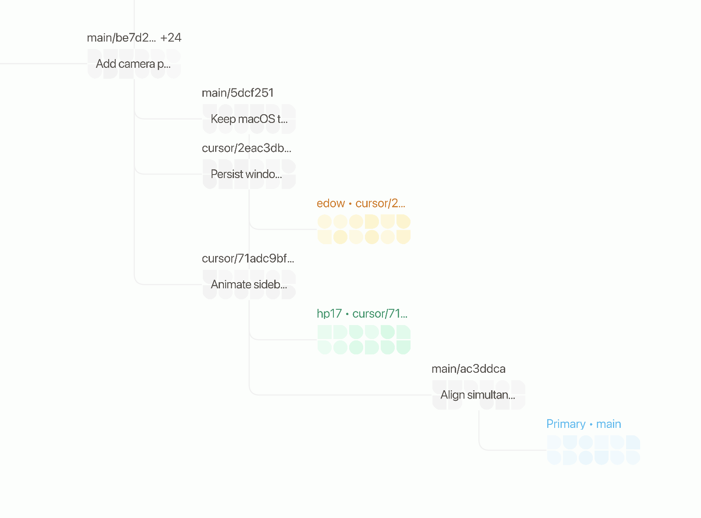

# Cobble

Cobble is a native macOS app for exploring local Git repositories as a spatial branch map. It keeps branches, commits, worktrees, dirty state, and repository activity visible in one calm, fast canvas.



## Download

[Download the latest version of Cobble](https://github.com/lupfister/cobble/releases/latest)

The release page includes builds for Apple Silicon and Intel Macs. Cobble checks for signed updates automatically and also provides **Cobble → Check for Updates…** in the macOS menu bar.

> Cobble is currently distributed outside the Mac App Store and is ad-hoc signed, not Apple-notarized.

## Highlights

- Spatial branch and commit map built for large local repositories
- First-class worktree, stash, dirty-state, and remote-branch visibility
- Local Git operations through the native Tauri/Rust backend
- GitHub integration through the authenticated `gh` CLI
- Optional AI-generated commit and stash titles through OpenCode
- Background repository watching, persisted layouts, and virtualized rendering

## Development

Prerequisites:

- macOS
- Node.js 22 or newer
- pnpm 10
- Rust stable
- Git

Install dependencies and launch the native app:

```bash
pnpm install
pnpm tauri dev
```

Useful checks:

```bash
pnpm test
pnpm build
cargo check --manifest-path src-tauri/Cargo.toml
```

## Releases

Releases are built for Apple Silicon and Intel by GitHub Actions. The workflow publishes DMGs, signed updater archives, and `latest.json` to GitHub Releases.

To publish a new version, update the version in `package.json`, `src-tauri/Cargo.toml`, `src-tauri/Cargo.lock`, and `src-tauri/tauri.conf.json`, then run the **Release Cobble** workflow after the change reaches `main`.
